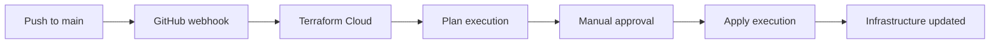
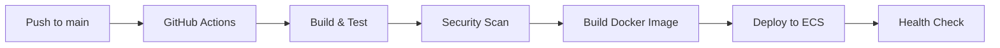

# Blog Portfolio Infrastructure Setup Guide

This guide walks you through setting up the blog portfolio infrastructure using **Terraform Cloud** with GitHub integration - the recommended best practice for production deployments.

## 🏗️ Architecture Overview

- **Single Environment**: Production only (cost-optimized)
- **Terraform Cloud**: Manages state and executes plans/applies
- **GitHub Integration**: Triggers Terraform Cloud runs via VCS workflow
- **AWS Free Tier**: Optimized to stay within free tier limits

## 📋 Prerequisites

1. **AWS Account** with appropriate permissions
2. **Terraform Cloud Account** (free tier available)
3. **GitHub Repository** for your code
4. **Domain** (optional, for custom domain setup)

## 🚀 Step-by-Step Setup

### Step 1: Set Up Terraform Cloud

1. **Create Terraform Cloud Account**
   - Go to [app.terraform.io](https://app.terraform.io)
   - Sign up for a free account
   - Create an organization (e.g., `your-company-name`)

2. **Create Workspace**
   - Click "New Workspace"
   - Choose "Version control workflow"
   - Connect to your GitHub repository (`blog-portfolio-infra`)
   - Name the workspace: `blog-portfolio-prod`
   - Set working directory to: `terraform/`

3. **Configure Workspace Settings**
   - Go to workspace settings
   - Set Terraform version to `1.6.0` or later
   - Enable auto-apply (optional, for automatic deployments)

### Step 2: Configure AWS Credentials in Terraform Cloud

**Option A: IAM User (Simple)**
1. Create IAM user with PowerUser permissions
2. Generate access keys
3. In Terraform Cloud workspace, go to Variables
4. Add environment variables:
   - `AWS_ACCESS_KEY_ID` (sensitive)
   - `AWS_SECRET_ACCESS_KEY` (sensitive)
   - `AWS_DEFAULT_REGION` = `eu-central-1`

**Option B: OIDC (Recommended for Production)**
1. Deploy the IAM module first to create OIDC provider
2. Configure Terraform Cloud to use OIDC
3. Set environment variables:
   - `TFC_AWS_PROVIDER_AUTH` = `true`
   - `TFC_AWS_RUN_ROLE_ARN` = `<github-actions-role-arn>`

### Step 3: Set Terraform Variables

In your Terraform Cloud workspace, add these **Terraform variables**:

```hcl
# Required variables
environment = "prod"
owner = "your-name"
github_repository = "your-username/blog-portfolio-app"

# Optional variables (defaults will be used if not set)
cost_budget_limit = 15
domain_name = ""  # Set if you have a custom domain
```

### Step 4: Update Configuration Files

1. **Update Terraform Cloud Organization**
   ```hcl
   # In terraform/main.tf
   cloud {
     organization = "your-terraform-cloud-org"  # Replace with your org
     workspaces {
       name = "blog-portfolio-prod"
     }
   }
   ```

2. **Update GitHub Repository**
   ```hcl
   # In terraform/environments/prod.tfvars
   github_repository = "your-username/blog-portfolio-app"  # Replace with your repo
   ```

### Step 5: Configure GitHub Secrets

Add these secrets to your GitHub repository:

**For Infrastructure Repository (`blog-portfolio-infra`)**:
```
TF_API_TOKEN=<terraform-cloud-api-token>
INFRACOST_API_KEY=<infracost-api-key>  # Optional, for cost estimation
```

**For Application Repository (`blog-portfolio-app`)**:
```
AWS_ROLE_ARN_PROD=<github-actions-role-arn>
ECR_REPOSITORY_PROD=<ecr-repository-name>
ECS_CLUSTER_PROD=<ecs-cluster-name>
ECS_SERVICE_PROD=<ecs-service-name>
S3_BUCKET_PROD=<frontend-s3-bucket-name>
CLOUDFRONT_DISTRIBUTION_ID_PROD=<cloudfront-distribution-id>
ALB_DNS_NAME_PROD=<alb-dns-name>
```

### Step 6: Initial Deployment

1. **Deploy Infrastructure**
   - Push changes to `main` branch of `blog-portfolio-infra`
   - Terraform Cloud will automatically trigger a run
   - Review the plan in Terraform Cloud UI
   - Apply the changes (manual approval required unless auto-apply is enabled)

2. **Get Output Values**
   - After successful apply, note the output values from Terraform Cloud
   - Update GitHub secrets with the actual resource names/ARNs

3. **Deploy Application**
   - Push changes to `main` branch of `blog-portfolio-app`
   - GitHub Actions will build and deploy frontend and backend

## 🔄 Workflow Overview

### Infrastructure Changes


### Application Deployment


## 🛡️ Security Best Practices

1. **Terraform Cloud**
   - Use OIDC instead of long-lived credentials
   - Enable team access controls
   - Use workspace-level permissions

2. **GitHub**
   - Use environment protection rules
   - Require reviews for production deployments
   - Use branch protection rules

3. **AWS**
   - Follow least privilege principle
   - Use IAM roles instead of users where possible
   - Enable CloudTrail for audit logging

## 💰 Cost Optimization

The infrastructure is designed to stay within AWS Free Tier:

- **RDS**: db.t3.micro (750 hours/month free)
- **ECS Fargate**: 20 GB-hours storage + 5 GB-hours memory free
- **S3**: 5GB storage + 20K GET requests free
- **CloudFront**: 1TB data transfer + 10M requests free
- **ALB**: 750 hours/month free (new accounts)

**Estimated Monthly Cost**: ~$15-25/month after free tier

## 🔧 Troubleshooting

### Common Issues

1. **Terraform Cloud Run Fails**
   - Check AWS credentials in workspace variables
   - Verify IAM permissions
   - Check Terraform syntax in plan output

2. **GitHub Actions Fails**
   - Verify GitHub secrets are set correctly
   - Check AWS role trust policy for OIDC
   - Ensure ECR repository exists

3. **Application Not Accessible**
   - Check ECS service is running
   - Verify ALB target group health
   - Check security group rules

### Useful Commands

```bash
# Check Terraform Cloud runs
terraform login
terraform workspace list

# Check AWS resources
aws ecs describe-services --cluster blog-portfolio-prod --services blog-portfolio-prod-backend
aws s3 ls blog-portfolio-frontend-*
aws cloudfront list-distributions

# Check application health
curl https://your-cloudfront-domain.com/health
```

## 📚 Additional Resources

- [Terraform Cloud Documentation](https://developer.hashicorp.com/terraform/cloud-docs)
- [AWS Free Tier Details](https://aws.amazon.com/free/)
- [GitHub Actions with OIDC](https://docs.github.com/en/actions/deployment/security-hardening-your-deployments/configuring-openid-connect-in-amazon-web-services)
- [ECS Fargate Pricing](https://aws.amazon.com/fargate/pricing/)

## 🤝 Support

If you encounter issues:
1. Check the troubleshooting section above
2. Review Terraform Cloud run logs
3. Check GitHub Actions logs
4. Verify AWS resource status in console

---

**Next Steps**: After successful deployment, you can access your blog at the CloudFront distribution URL and start adding content!